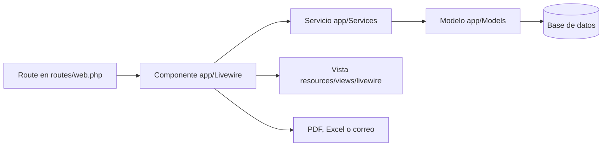

# Mapa técnico y mejoras del proyecto

> Proyecto: Recursos Humanos - Asistencia Biométrica  
> Actualizado: 5 de octubre de 2026  
> Base Git: `db502eed`  
> Fuente: Graphify 0.9.76 y verificación directa del código actual

## 1. Resumen ejecutivo

Este repositorio es una aplicación Laravel 11 de Recursos Humanos orientada a:

- administración de personal y accesos;
- importación y sincronización de relojes biométricos ZKTeco;
- control de marcaciones, horarios, tolerancias y fechas especiales;
- permisos, bajas médicas, incidencias y comprobantes;
- reportes, sanciones, planilla de refrigerio y auditoría;
- consulta pública por carnet y perfiles compartidos mediante URL firmada.

La aplicación usa Livewire como capa de interacción. El flujo principal es:



El diseño general es funcional y cuenta con pruebas para los flujos principales. El mayor costo de mantenimiento está concentrado en archivos muy grandes y en lógica de asistencia repetida entre `PersonalPage` y `AnalisisAsistenciaService`.

## 2. Estado del análisis con Graphify

Comandos ejecutados:

```powershell
graphify extract . --code-only
graphify cluster-only "C:\Users\WILLIAMS\Desktop\recursos-humanos-master"
graphify explain PersonalPage
graphify explain AnalisisAsistenciaService
graphify explain "app/Models/Empleado.php::Empleado"
graphify explain RegistroAsistencia
graphify explain IncidenciasPage
graphify explain ImportacionBiometricaService
graphify explain SucursalNormalizer
```

Resultado:

- 203 archivos de código analizados;
- 2.308 nodos;
- 4.716 relaciones;
- 169 comunidades;
- 100 % de relaciones extraídas del código;
- 0 ciclos de importación detectados;
- sin uso de API externa ni envío de archivos;
- sin señal `needs_update` inmediatamente después de generar el grafo.

Nodos con más conexiones:

| Nodo | Relaciones | Lectura práctica |
|---|---:|---|
| `Empleado` | 318 | Entidad central del dominio. Conecta personal, asistencia, permisos, usuarios y reportes. |
| `RegistroAsistencia` | 189 | Núcleo operativo de marcaciones y cálculos. |
| `PersonalPage` | 135 | Componente con demasiadas responsabilidades de interfaz y reporte. |
| `User` | 107 | Autenticación, roles y vínculo opcional con empleado. |
| `PermisoLaboral` | 99 | Incidencias, boletas, estados y comprobantes. |
| `AnalisisAsistenciaService` | 86 | Motor compartido para cálculos, reportes y consultas. |
| `SucursalNormalizer` | 83 | Normalización transversal de sucursales. |
| `IncidenciasPage` | 69 | CRUD, aprobación, rechazo y archivos de permisos. |
| `ImportacionBiometricaService` | 58 | Ingesta, normalización y persistencia biométrica. |

Limitación conocida: Graphify no enlazó automáticamente los nombres de vistas Blade devueltos como cadenas. La relación `PersonalPage` → `livewire.personal`, por ejemplo, se confirmó directamente en `render()`.

Artefactos generados:

- `graphify-out/GRAPH_REPORT.md`: informe automático;
- `graphify-out/graph.json`: grafo consultable;
- `graphify-out/graph.html`: explorador visual;
- `.graphifyignore`: exclusión de secretos, dependencias y archivos pesados.

## 3. Tecnologías y entorno

| Capa | Tecnología |
|---|---|
| Backend | PHP `^8.2`, Laravel `^11.0` |
| UI reactiva | Livewire `^3.5` |
| Autorización | Spatie Laravel Permission `^6.25` |
| PDF | `barryvdh/laravel-dompdf` 3.1 |
| Excel | PhpSpreadsheet 2.2 |
| Frontend | Tailwind CSS 3.4, D3 7.9, TopoJSON, Trase Atlas |
| Pruebas | PHPUnit 11.5, SQLite en memoria |
| Sincronización | Scheduler de Laravel cada minuto y scripts Python/PowerShell |

Observaciones del entorno:

- `composer.json` exige PHP 8.2, pero `README.md` todavía indica PHP 8.1+.
- La carpeta `vendor` existe, pero falta `vendor/autoload.php`.
- `php artisan test` no pudo iniciar por esa dependencia incompleta.
- `node_modules` y `package-lock.json` están presentes.
- `SETUP_LARAVEL.md` declara SQLite como configuración local predeterminada.
- No se leyó ni indexó `.env`.

## 4. Mapa de carpetas

| Carpeta | Archivos | Responsabilidad |
|---|---:|---|
| `app/Livewire` | 19 | Estado de pantalla, validación, acciones y composición de vistas. |
| `app/Models` | 13 | Entidades Eloquent, relaciones, casts y scopes. |
| `app/Services` | 12 | Reglas de asistencia, biométricos, reportes, planillas y auditoría. |
| `app/Mail` | 2 | Correos institucionales y cambios de estado de boletas. |
| `app/Support` | 1 | Normalización compartida de sucursales. |
| `resources/views/livewire` | 19 | Pantallas Blade asociadas a componentes Livewire. |
| `resources/views/pdf` | 8 | Plantillas de exportación PDF. |
| `resources/views/layouts` | 2 | Layout autenticado y layout público. |
| `resources/views/emails` | 2 | Plantillas de correo. |
| `database/migrations` | 41 | Evolución del esquema. |
| `database/seeders` | 5 | Roles, reglas y datos auxiliares. |
| `tests/Feature` | 28 | Flujos funcionales y reglas de negocio. |
| `tests/Unit` | 3 | Conexión biométrica, extracción ZK y reporte por sucursales. |

Carpetas que no deben editarse para implementar lógica:

- `vendor`: dependencias PHP;
- `node_modules`: dependencias JavaScript;
- `storage`: archivos de ejecución, caché y datos temporales;
- `bootstrap/cache`: caché de Laravel;
- `public/css/app.css`: CSS generado por Tailwind.

## 5. Rutas, componentes y vistas

| Ruta | Acceso | Componente | Vista principal |
|---|---|---|---|
| `/` | Invitado | `Auth/LoginPage.php` | `livewire/auth/login.blade.php` |
| `/consulta-carnet` | Pública | `ConsultaCarnetPage.php` | `livewire/consulta-carnet.blade.php` |
| `/perfil-horas/{empleado}` | URL firmada | `PerfilHorasPage.php` | `livewire/perfil-horas.blade.php` |
| `/inicio` | `ver panel` | `InicioPage.php` | `livewire/inicio.blade.php` |
| `/panel` | `ver panel` | `DashboardPage.php` | `livewire/dashboard.blade.php` |
| `/importar` | `importar biometria` | `ImportarExcelPage.php` | `livewire/importar-excel.blade.php` |
| `/calendario` | `ver calendario` | `CalendarioPage.php` | `livewire/calendario.blade.php` |
| `/reportes` | `ver reportes` | `ReportesPage.php` | `livewire/reportes.blade.php` |
| `/mis-horas` | Usuario autenticado | `MisHorasPage.php` | `livewire/mis-horas.blade.php` |
| `/personal` | `gestionar personal` | `PersonalPage.php` | `livewire/personal.blade.php` |
| `/personal-especial` | `gestionar personal` | `PersonalEspecialPage.php` | `livewire/personal-especial.blade.php` |
| `/horarios` | `gestionar personal` | `HorariosPage.php` | `livewire/horarios.blade.php` |
| `/fechas-especiales` | `gestionar personal` | `FechasEspecialesPage.php` | `livewire/fechas-especiales.blade.php` |
| `/incidencias` | `gestionar personal` | `IncidenciasPage.php` | `livewire/incidencias.blade.php` |
| `/planilla-refrigerio` | `gestionar personal` | `PlanillaRefrigerioPage.php` | `livewire/planilla-refrigerio.blade.php` |
| `/reglamento-sanciones` | `gestionar personal` | `ReglamentoSancionesPage.php` | `livewire/reglamento-sanciones.blade.php` |
| `/accesos` | `gestionar accesos` | `GestionAccesosPage.php` | `livewire/gestion-accesos.blade.php` |
| `/auditoria` | `ver auditoria` | `AuditoriaPage.php` | `livewire/auditoria.blade.php` |

`EstructuraCodigoPage.php` y `livewire/estructura-codigo.blade.php` existen, pero no tienen una ruta activa. Sus métricas también alimentan `DashboardPage` mediante `AnalisisAsistenciaService`.

## 6. Modelo de dominio

### Entidades centrales

- `Empleado`: datos personales, código biométrico, sucursal, horario individual, vigencia laboral, foto y relaciones con usuario, asistencias y permisos.
- `RegistroAsistencia`: entrada, salida, fecha, evento biométrico, estado, observación, importación y campos de auditoría.
- `PermisoLaboral`: permisos, paros, incidencias, cumpleaños y faltas; admite rangos de días u horas, estados y motivo de rechazo.
- `PermisoComprobante`: archivo adjunto en ruta, binario o Base64.
- `User`: autenticación, roles/permisos y vínculo con un empleado.

### Configuración operativa

- `HorarioRegional`: entrada, salida y tolerancias diaria/mensual por sucursal.
- `FechaEspecialLaboral`: feriados o jornadas especiales por fecha y alcance.
- `TipoPermiso`: catálogo editable con valores predeterminados.
- `ReglaSancion`: rangos, sanción, categoría y vigencia temporal.

### Integración y trazabilidad

- `BiometricoDispositivo`: conexión, estado y última sincronización de cada reloj.
- `Importacion`: lote de importación y resumen de resultados.
- `PlanillaRefrigerio`: cálculo guardado por período y sucursal.
- `Auditoria`: actor, acción, entidad, estado anterior, estado posterior y metadatos.

Relaciones principales:

```text
User ── pertenece opcionalmente a ── Empleado
Empleado ── tiene muchas ── RegistroAsistencia
Empleado ── tiene muchos ── PermisoLaboral
PermisoLaboral ── tiene muchos ── PermisoComprobante
Importacion ── tiene muchos ── RegistroAsistencia
```

## 7. Lógica principal

### Asistencia y reportes

`AnalisisAsistenciaService.php` concentra calendario, métricas, reportes por rango, detalle mensual, atrasos, omisiones, antigüedad, cumpleaños y rankings. Lo consumen `DashboardPage`, `CalendarioPage`, `ReportesPage`, `PerfilHorasPage`, `ConsultaCarnetPage`, `PlanillaRefrigerioPage` e `ImportarExcelPage`.

`ProgramacionLaboralService.php` resuelve horarios, feriados, días no laborables, tolerancias y minutos de incidencia. Debe seguir siendo la fuente única de programación laboral.

`SucursalNormalizer.php` normaliza nombres y agrupaciones de sucursales. Es una dependencia transversal y debe reutilizarse en vez de crear reglas locales nuevas.

### Biométricos

Flujo automático:

```text
Scheduler cada minuto
  -> biometrico:sync
  -> SincronizacionBiometricoService
  -> ConexionBiometricoService / ExtraccionBiometricoZkService
  -> ImportacionBiometricaService
  -> Empleado + Importacion + RegistroAsistencia
```

La importación manual desde `/importar` usa el mismo servicio de persistencia. El archivo como respaldo y la conexión ZK directa conviven.

### Incidencias y boletas

`IncidenciasPage.php` administra tipos de permiso, CRUD de solicitudes, comprobantes, aprobación/rechazo, PDF, correo y auditoría. `ConsultaCarnetPage.php` y `PerfilHorasPage.php` permiten generar boletas desde experiencias públicas o firmadas.

### Reglamento y sanciones

`ReglamentoSancionService.php` evalúa atrasos, inasistencias y omisiones. `AnalisisReglamentoReporteService.php` genera reportes individuales y consolidados. `ReglaSancion.php` decide si cada regla aplica al período consultado.

### Exportaciones

- PDF: plantillas en `resources/views/pdf` mediante Dompdf.
- Excel: `BoletaExcelService`, `PlanillaRefrigerioService` y exportaciones desde componentes Livewire.
- Correo: `ComunicadoPersonalMailable` y `BoletaEstadoMailable`.

## 8. Vistas que conviene mantener identificadas

| Vista | Líneas | Responsabilidad actual | Mejora segura |
|---|---:|---|---|
| `livewire/personal.blade.php` | 4.585 | Personal, inactivos, marcaciones, control, sucursales, correos y múltiples modales. | Extraer parciales por pestaña y por modal sin cambiar nombres de eventos Livewire. |
| `livewire/reportes.blade.php` | 2.822 | Resumen, atrasos, omisiones, cumpleaños, rankings, antigüedad y sanciones. | Extraer un parcial por pestaña. |
| `livewire/perfil-horas.blade.php` | 1.960 | Perfil público, marcaciones, boletas, comprobantes y normativa. | Separar contenido principal, modal de boleta y modal normativo. |
| `livewire/reglamento-sanciones.blade.php` | 1.012 | Reglas, edición y vigencias. | Separar formularios y tabla cuando se modifiquen. |
| `livewire/personal-especial.blade.php` | 909 | Alta, vínculo y carga mensual de personal especial. | Separar gestión de empleado y grilla mensual. |
| `livewire/calendario.blade.php` | 791 | Calendario y detalle diario. | Mantener junto salvo que crezca el detalle. |
| `livewire/planilla-refrigerio.blade.php` | 752 | Cálculo, detalle y exportación. | Separar modal de detalle. |
| `livewire/consulta-carnet.blade.php` | 683 | Consulta, boleta, correo y comprobante. | Compartir reglas de boleta con `PerfilHorasPage`; no compartir estado visual. |

No conviene crear un sistema genérico de componentes para todo. Primero deben extraerse solo los bloques grandes que ya tienen límites claros.

## 9. Puntos de mejora priorizados

### P0: entorno y seguridad

- [ ] Ejecutar `composer install` y recuperar `vendor/autoload.php`.
- [ ] Ejecutar `php artisan test` y registrar el primer resultado base.
- [ ] Cambiar `README.md` de PHP 8.1+ a PHP 8.2+.
- [ ] Revisar `/consulta-carnet`: es pública y no tiene middleware de límite de solicitudes en `routes/web.php`. Agregar `throttle` si debe seguir pública.
- [ ] Eliminar el valor predeterminado `changeme123` de `config/asistencia.php` en producción. Exigir `ASISTENCIA_PASSWORD_INICIAL` o generar una contraseña segura.
- [ ] Cifrar `BiometricoDispositivo.communication_password` mediante un cast `encrypted` y evitar mostrarlo completo en Livewire.
- [ ] Revisar `composer.json`: `audit.block-insecure` está en `false`.

### P1: reducir duplicación de lógica

- [ ] Comparar con pruebas las implementaciones duplicadas de `normalizarMarcacionAsistencia`, `calcularMinutosRetraso` y `formatearMinutosEtiqueta`.
- [ ] Si su comportamiento es equivalente, hacer que `PersonalPage` delegue en `AnalisisAsistenciaService` y eliminar sus copias privadas.
- [ ] Mantener horarios y tolerancias únicamente en `ProgramacionLaboralService`.
- [ ] Comparar el flujo de boletas de `ConsultaCarnetPage` y `PerfilHorasPage`. Extraer solo validación/payload compartido; conservar el estado de modal en cada componente.
- [ ] Evitar nuevos `catch (Throwable)` silenciosos. Registrar el error o devolver un estado distinguible cuando una falla de base de datos no sea una condición esperada.

### P2: dividir archivos grandes por límites existentes

- [ ] Dividir `resources/views/livewire/personal.blade.php` en parciales para `personal`, `inactivos`, `marcaciones`, `control`, `sucursales` y modales.
- [ ] Dividir `resources/views/livewire/reportes.blade.php` por las siete pestañas ya existentes.
- [ ] Antes de dividir `PersonalPage.php`, mover cálculos duplicados a servicios existentes. Después separar únicamente acciones con un límite estable.
- [ ] Evaluar si `EstructuraCodigoPage` debe recibir una ruta protegida o eliminarse. No dejarla como componente huérfano.

### P3: documentación y operación

- [ ] Actualizar `INTEGRACION_BIOMETRICO.md`; describe preparación inicial, pero el código ya incluye sincronización ZK y scheduler.
- [ ] Documentar qué archivos de `graphify-out` se versionarán. Recomendados: `graph.json` y `GRAPH_REPORT.md`; omitir caché, costos y manifiestos.
- [ ] Añadir al README los comandos reales para servidor, scheduler, pruebas y actualización del grafo.

## 10. Orden recomendado para mejorar sin romper comportamiento

1. Restaurar dependencias y obtener una suite verde.
2. Añadir pruebas para cualquier regla duplicada que todavía no esté cubierta.
3. Delegar cálculos de `PersonalPage` en servicios existentes.
4. Extraer parciales Blade sin cambiar propiedades ni eventos Livewire.
5. Proteger credenciales y rutas públicas.
6. Actualizar documentación.
7. Ejecutar `graphify update . --code-only` y revisar cambios de conexiones.

Este orden reduce riesgo: primero crea una red de seguridad, luego elimina duplicación y finalmente reorganiza presentación.

## 11. Cobertura de pruebas observada

Hay pruebas específicas para:

- análisis de asistencia;
- atrasos, tolerancias y reglamento;
- permisos, comprobantes, baja médica y boletas;
- personal normal y especial;
- búsquedas de marcaciones;
- reportes y sucursales;
- accesos y fotos;
- importación CSV y servicios ZKTeco;
- fechas especiales, planilla de refrigerio y sincronización.

Estado al 5 de octubre de 2026:

```text
PlanillaRefrigerioTest: 11 pruebas, 106 verificaciones correctas.
ReporteReglamentoTest + ReportesMejorasTest: 16 pruebas, 143 verificaciones correctas.
```

Regla de refrigerio implementada: solo una jornada con entrada y salida completas genera pago. Faltas, omisiones de entrada o salida, permisos, bajas médicas, comisiones y feriados/asuetos se consolidan como días no pagados. La misma fuente de cálculo alimenta planilla, PDF, Excel y la pestaña Refrigerio de Reportes.

Nota del entorno: en esta instalación de PHP para Windows, `is_readable()` devuelve `false` incluso para archivos legibles y PHPUnit rechaza el `bootstrap` configurado. Las pruebas se ejecutaron cargando `vendor/autoload.php` antes de iniciar PHPUnit, sin cambiar código de producción.

## 12. Estado local que debe preservarse

Al generar este documento ya existían cambios sin confirmar en:

- `app/Livewire/ConsultaCarnetPage.php`;
- `app/Livewire/PersonalPage.php`;
- `resources/views/livewire/consulta-carnet.blade.php`;
- `resources/views/livewire/personal.blade.php`;
- `resources/views/pdf/marcaciones-personal.blade.php`;
- `resources/views/pdf/marcaciones-sucursales.blade.php`;
- `tests/Feature/ReportePermisosBajaMedicaTest.php` como archivo nuevo.

El análisis incluyó ese estado actual. No deben sobrescribirse ni descartarse esos cambios durante futuros refactors.

## 13. Cómo mantener este mapa

Después de modificar código:

```powershell
graphify update "C:\Users\WILLIAMS\Desktop\recursos-humanos-master"
```

Para consultar un símbolo:

```powershell
graphify explain PersonalPage
graphify explain AnalisisAsistenciaService
graphify explain "app/Models/Empleado.php::Empleado"
```

Para comprobar frescura:

```powershell
graphify check-update .
git rev-parse HEAD
```

Este documento debe actualizarse cuando cambien rutas, entidades principales, límites de módulos o prioridades del backlog.
